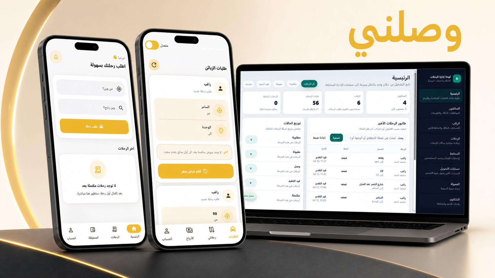
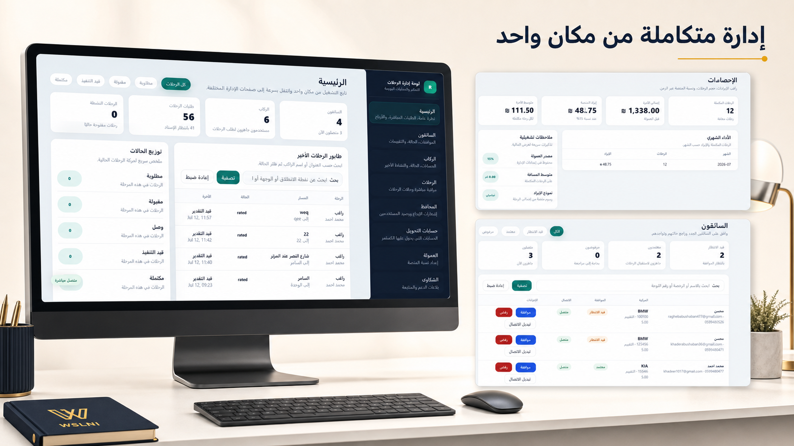
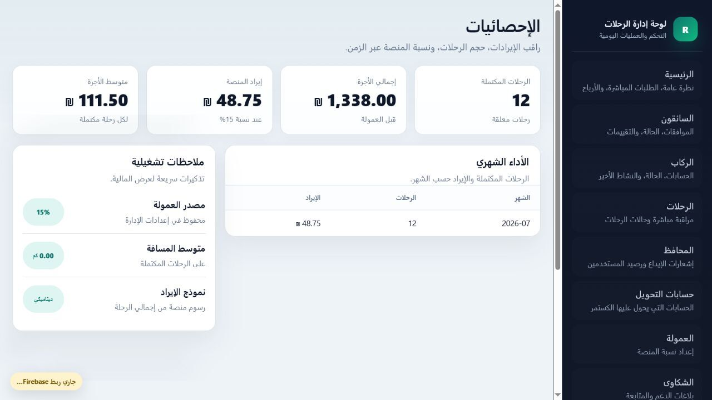
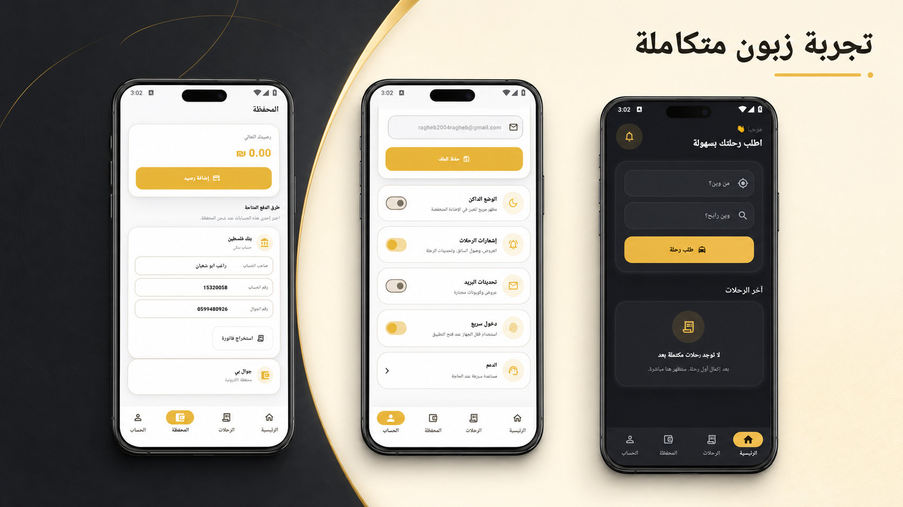
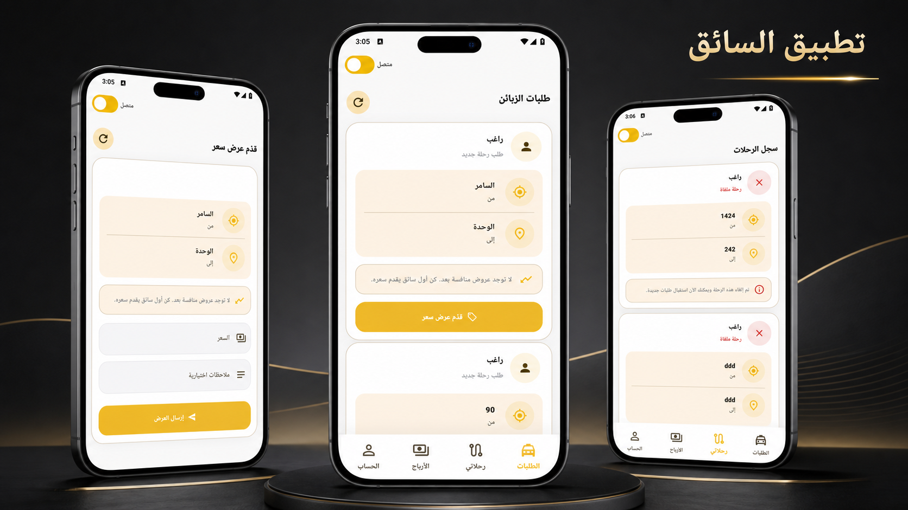

# Ride-Hailing Starter

هيكل مشروع مبدئي لتطبيق توصيل ركاب:

- `backend/` = Laravel admin + API
- `apps/customer_app/` = تطبيق الكستمر Flutter
- `apps/driver_app/` = تطبيق السائق Flutter

## معرض الواجهات

استعراض للواجهات الرئيسية لمنصة **وصلني**، بما يشمل تطبيق العميل وتطبيق السائق ولوحة الإدارة.

### المنصة ولوحة الإدارة







### تطبيق العميل



### تطبيق السائق



## تشغيل الـ backend

```bash
cd backend
php artisan serve --host=0.0.0.0 --port=8000
```

## تشغيل تطبيق الكستمر

```bash
cd apps/customer_app
flutter run
```

## تشغيل تطبيق السائق

```bash
cd apps/driver_app
flutter run
```

## ما تم تجهيزه

- Admin dashboard أولي في Laravel
- API routes أساسية للـ auth والرحلات والسائقين والعملاء
- شاشتان Flutter عمليتان بدل شاشة العداد الافتراضية
- اختبارات Flutter محدثة للتأكد من تحميل الشاشات الجديدة


## Project Status

This repository is under active development.

## Local API URL

The Flutter apps use the laptop API by default:

- API URL: `http://10.0.0.3:8000/api`
- Laravel must run on the network host:

```bash
php artisan serve --host=0.0.0.0 --port=8000
```

You can still override the API URL when running Flutter:

```bash
flutter run --dart-define=API_BASE_URL=http://10.0.0.3:8000/api
```
